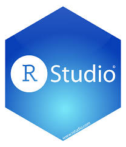
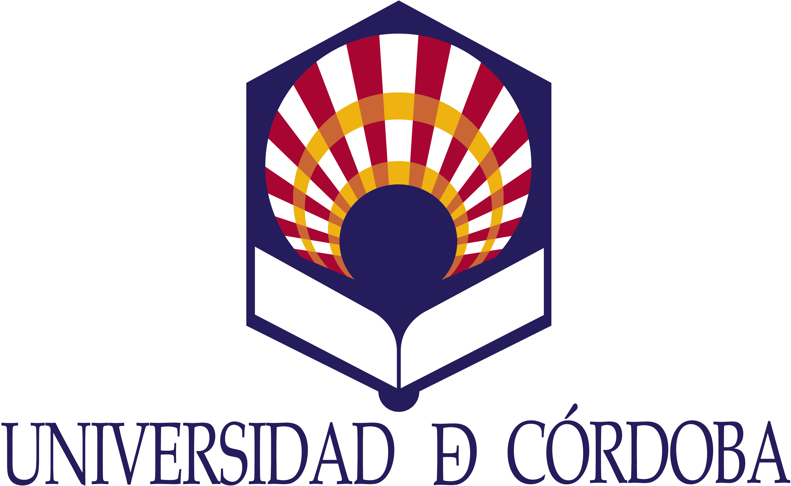

{ width=10% } { width=10% } { width=10% } { width=10% }

## Presentación

La demanda de analistas de datos dentro de los ámbitos tecnológico y científico está creciendo rápidamente. En estos momentos, la toma de decisiones en el entorno empresarial, académico y de las administraciones públicas se basa en información generada a partir de un volumen creciente de datos. El término ***Big Data*** es hoy uno de los más usados en el mundo tecnológico. Este curso, ayudará a los alumnos a desarrollar las **capacidades básicas** necesarias para la ***Ciencia de Datos***, como por ejemplo, programación en `R`, búsqueda y descarga de datos en internet, procesado y limpieza de datos, visualización e interpretación de resultados.

El curso se plantea como una introducción al análisis de datos de una forma práctica mediante el uso del software `R`, de forma que al finalizar, se pretende que el alumno sea capaz de: _analizar y comprender la estructura de los datos con los que se trabaja, su observación, visualización y representación_.

## Información

#### _Secretaría Técnica y Coordinación_: 
  - [Dra. María Dolores Pérez ](mailto:dpcalle@uco.es) 
    + Dept. Genética ETSIAM.
    + Universidad de Córdoba.
  
#### Dirección Académica y Profesorado:
  - [Dr. José V. Die ](mailto:jdie@uco.es)
    + Dept. de Genética ETSIAM.
    + Universidad de Córdoba.  
  - [Dr. José R. Caro ](mailto:jrcaro@uco.es)
    + Dpto. de Estadística, Econometría, Investigación Operativa, Organización de Empresas y Economía Aplicada.
    + Universidad de Córdoba.  

## Fechas del Curso y Lugar

**Lugar:** Aula de Geoespaciales, 2a Planta. Edificio Ramón y Cajal (SCAI). Campus Universitario de Rabanales.

* Se ha organizado el curso en los siguientes días y horas.

| **Semana I**   | **Día** | **Hora** |
|:---------------|:-------|:------|
| | Jueves, 9 diciembre   | 16:00-20:15  |
| | Viernes, 10 diciembre | 09:00-13:15  |
| **Semana II** | | |
| | Lunes, 13 diciembre   | 16:00-20:15  |
| | Martes, 14 diciembre | 16:00-20:15  |
| | Miércoles, 15 diciembre   | 16:00-20:15 |
| | Jueves, 16 diciembre   | 16:00-20:15  |
| | Viernes, 17 diciembre | 09:00-13:30  |

## Programa del Curso

#### Módulo 1: Fundamentos básicos de `R`.
  - Instalación de `R` y `RStudio`
  - Entorno de trabajo
  - Definiendo vectores
  - Manipulando vectores
  - Tablas de datos
  
#### Módulo 2: Análisis de Exploración de Datos.
#### Módulo 3: Limpieza y manipulación datos con `tidyverse`.
#### Módulo 4: Cadenas de texto.
#### Módulo 5: Funciones en `R`.

## Código de Conducta

Los organizadores del curso *Introducción a R para el Análisis de Datos* se comprometen a proporcionar una experiencia acogedora y libre de acoso para todos, independientemente de su género, identidad de género y expresión, edad, orientación sexual, discapacidad, apariencia física, tamaño corporal, raza, etnia, religión (o falta de ella) u elecciones de tecnología. No toleramos el acoso de los participantes en el curso de ninguna forma. El lenguaje y las imágenes sexuales no son apropiadas para ningún lugar del curso, incluídas las clases teóricas, ejercicios, descansos, Twitter y otros medios on line. Los participantes del curso que violen estas reglas pueden ser sancionados o expulsados del curso a discreción de los organizadores del curso.

Este código de conducta se aplica a todos los participantes, incluyendo al personal y profesorado del curso, y se aplica a todos los modos de interacción, tanto en persona como on line, incluyendo los repositorios de proyectos GitHub, la plataforma Moodle, los canales de Slack y Twitter.

Los participantes en el curso aceptan:

- Ser considerados en la forma de expresarse y de actuar y ser respetuosos con los límites de los demás asistentes.
- Abstenerse de comportamientos y expresiones degradantes, discriminatorias o acosadoras. El acoso incluye, pero no se limita a: intimidación deliberada; fotografía o grabación no deseada; interrupción sostenida o deliberada de las conversaciones y otros eventos; contacto físico inapropiado; uso de imágenes sexuales o discriminatorias; comentarios, bromas y atención sexual no deseada. Si piensas que alguien te ha acosado o te ha tratado de manera inapropiada, por favor diríjete en persona a cualquier responsable del curso.
- Cuidar unos de otros. Si observas una situación peligrosa, alguien en apuros o violaciones de este código de conducta, incluso si parecen intrascendentes, avisa a un responsable del curso.

**¿Necesitas ayuda?**

**Si tienes alguna duda o inquietud, puedes hablar con Lola Pérez, José R. Caro o José Die.**

Si alguno de los asistentes tiene un comportamiento de acoso, cualquier responsable del curso puede tomar la acción legal que consideremos apropiada, que incluye, entre otras, advertir a esa persona o pedirle que abandone el curso. (Si alguien considera que ha sido injustamente acusado de violar este código de conducta, debe comunicarse con el resto de responsables del curso por escrito con una descripción concreta de su queja).

Cualquier comentario sobre este y cualquier otro aspecto del curso es muy bien recibido y agradecemos tu colaboración para que que sea una experiencia segura, agradable y amistosa para todos los que participan.

Este código de conducta se ha adaptado del código de conducta de la conferencia [rOpenSci’s 2018](https://unconf18.ropensci.org/coc.html) y a su vez se basa en el código de conducta de [ROpenSci](https://ropensci.org/code-of-conduct/). 

Este código de conducta está bajo la licencia:

  <a rel="license" href="http://creativecommons.org/licenses/by-sa/4.0/">Creative Commons Attribution-ShareAlike 4.0 International License</a>.

### *_Cambios de Última Hora_

_Es posible que el esquema y plan del curso visto anteriormente pueda sufrir modificaciones y readaptaciones en función de la disponibilidad del aula de impartición y/o el grado de avance de la materia._

## Archivos de interés

- Guía de estilo (por [Hadley Wickham](http://adv-r.had.co.nz/Style.html))
- Code to Joy (The Economist, por [Andrew Smith](https://www.economist.com/1843/2018/05/29/code-to-joy))

---

Con la colaboración de:

{ width=15% } { width=15% }